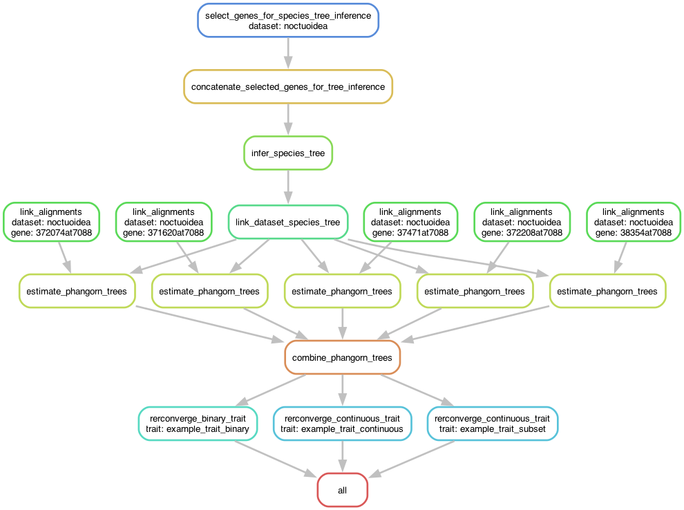

# Snakemake pipeline for running RERconverge on multiple suites of traits

The aim of this workflow is to provide a reproducible way to perform analyses
to associate evolutionary rates with convergent traits using RERconverge. It
takes gene alignments and a table of trait data as input. RERconverge will be
run for each trait in the table. Both binary (trait values 0 or 1) and
continuous (trait values are continuous integers or floats) traits can be
included in the same table and run in the same workflow run.

## Required inputs

- A `config.yaml` file ([example](config/config.yaml)) which sets workflow
  parameters.
- A `traits.tsv` table ([example](config/example-traits.tsv)), a table of traits
  where each row is a different taxon (names matching those in the gene
  alignments) and each column is a trait. All traits do not need to have values
  for all taxa, the analyses will be run for each trait on the taxa which have a
  value for the given trait. There can be an arbitrary number of traits, but all
  traits will be analyzed using the same alignments. Binary traits should be
  given trait values of 0 and 1, where 1 refers to foreground species.
  Continuous traits should be given numeric values (integer or floats).
- A set of gene alignments in a directory (set in `config.yaml`) or as a table
  ([example](config/example_alignment_list.tsv)). If a directory all alignments,
  in the directory will be used and genes will be named after the fasta file
  names. If a list is given the first column is the gene name and the second
  column is a path to the fasta file.
- (Optionally) a species tree in Newick format. Tips should match names in the
  alignments and `traits.tsv`. If a tree isn't provided it can be inferred from
  all or a subset of the gene alignments by setting 'infer-tree' in the
  `config.yaml`.

## Installing the pipeline

You'll need Snakemake as well as Apptainer/Singularity to run this workflow, you
can install Snakemake with Conda like so:

```bash
conda create -c conda-forge -c bioconda -c nodefaults -n snakemake snakemake
```

This workflow is easiest to deploy with snakedeploy, so I recommend adding that
as well as any executor plugins you need. For example, to make the environment
with snakedeploy and SLURM support, run:

```bash
conda create -c conda-forge -c bioconda -c nodefaults -n snakemake snakemake \
    snakedeploy snakemake-executor-plugin-slurm
```

Once you have Snakemake and Snakedeploy ready, you can deploy the pipeline in
your current working directory with:

```bash
snakedeploy deploy-workflow https://github.com/zjnolen/rerconverge-snakemake --tag main
```

## Workflow outline

Here is a simplified flow of the workflow. It uses five genes and three traits
as an example, but the workflow will scale to any number of genes and traits.



## Suggested customizations

### Job grouping for tree scaling

RERconverge uses phangorn to generate fixed topology gene trees with branches
scaled based on the gene alignments. These can take some time to generate if all
are done sequentially. To speed this up, each gene is done as a
separate job, but this can lead to many short running small jobs. N of these
jobs can be put into a group and submitted together by adding
`--group-components phangorn-trees=N` to the snakemake command.
